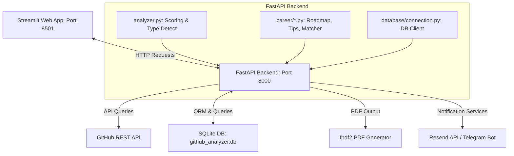

# 🗺️ GitHub Career Analyzer & AI Portfolio Auditor

<div align="center">
  
  
  
  
</div>

---

> [!IMPORTANT]
> **Try the App Live!**
> * 🌐 **Interactive Frontend UI**: [career-analyzer-app.streamlit.app](https://career-analyzer-app.streamlit.app/)
> * ⚙️ **Production FastAPI Documentation (Swagger UI)**: [github-career-analyzer.onrender.com/docs](https://github-career-analyzer.onrender.com/docs)

---

## 📖 Introduction
**GitHub Career Analyzer** is a high-performance portfolio auditor that evaluates your public GitHub profile and code repositories to determine your actual developer profile, audit your modern 2026 tech stack, calculate career readiness scores, and map your skills to **15 distinct job roles**.

It helps developers bridge the gap between their public portfolios and expectations in the current tech job market by generating personalized PDF roadmaps, project recommendations, and interview guides.

---

## 🌟 Key Features

### 🔍 1. Profile Quick Scan
* **Developer Type Detection**: Maps language frequency (Python, JavaScript, Go, etc.) to primary career types.
* **Balanced Scoring System**: Evaluates profiles on a 100-point scale:
  * **Profile Completeness (20%)**: Avatar, bio, location, and website details.
  * **Original Projects (35%)**: Count of non-forked repositories.
  * **Visibility & Engagement (20%)**: Star counts and repository engagement.
  * **Documentation Quality (20%)**: Percentage of repositories with descriptions.
* **Red Flags & Alerts**: Highlights issues like empty descriptions, high fork ratios, or low commit activity.
* **ATS Score Optimizer**: Evaluates portfolio discoverability and suggests quick, actionable fixes.

### 💼 2. Career Matcher & Analytics
* **15 Role Configurations**: Evaluates compatibility with specialized developer tracks.
* **2026 Tech Audit**: Audits standard foundation tools alongside modern capabilities (AI APIs, Copilot, Cursor integrations).
* **Company Tier Matching**: Evaluates compatibility with Startups, Mid-size, Product companies, FAANG/MAANG, Remote Opportunities, and Government/PSU requirements.
* **Salary Brackets**: Real-time localized (India/LPA) and remote ($/yr) salary estimations tailored by experience level.

### 📈 3. Growth & Learning Pathways
* **Weekly Roadmap**: A personalized study timeline containing verified resources (YouTube playlists, documentation, and practice platforms).
* **Custom Project Suggestions**: Curated project suggestions matching missing skills with varying difficulties.
* **Interview Practice Hub**: Tailored list of interview questions, portfolio tips, and common mistakes to avoid.

---

## 🛠️ Tech Stack & Architecture



| Component | Technology | Description |
| :--- | :--- | :--- |
| **Frontend UI** | Streamlit + Plotly | Interactive analytics dashboards & dynamic visualizations. |
| **Backend API** | FastAPI + Uvicorn | Asynchronous endpoint router. |
| **Database** | SQLite | Logs search history, leaderboard, and notification queues. |
| **PDF Engine** | fpdf2 | Generates custom-styled light-themed PDF reports. |
| **Notifications** | Resend API & Telegram | Delivers email digests and Telegram cards. |

---

## 💼 Supported Job Roles (15 Roles)

The platform evaluates your GitHub profile against **15 core software engineering roles** across **5 experience levels** (*Beginner, Internship Seeker, Fresher, Working Professional, Senior*):

```
├── Web & Full Stack          ├── Mobile Development        ├── Data & AI
│   ├── Frontend Developer    │   ├── Android Developer     │   ├── ML/AI Engineer
│   ├── Backend Developer     │   └── iOS Developer         │   ├── Data Scientist
│   └── Full Stack Developer  │                             │   └── Data Engineer
│                             ├── Specialty Systems         │
├── DevOps & Cloud            │   ├── Game Developer        ├── Security & Testing
│   ├── DevOps Engineer       │   └── Embedded Systems      │   ├── Cybersecurity Engineer
│   └── Cloud Engineer        │                             │   ├── QA Engineer
│                             └── Blockchain Developer      └── 
```

---

## ⚡ Performance Optimizations & Resilience

> [!TIP]
> **How we optimized performance by 75%**
> * **The Problem**: Querying languages and topics for 30+ repositories sequentially took up to **90 seconds**, causing network timeouts.
> * **The Fix**: Implemented **`ThreadPoolExecutor` parallel fetching** in [github_api.py](file:///c:/Users/sk191/Downloads/github-career-analyzer/github_api.py). The backend now pulls repository metrics concurrently in **under 20 seconds**.
> * **Error Handlers**: Added fallback wrappers in the Streamlit frontend. If the GitHub API hits rate limits, the UI degrades gracefully to inform the user instead of crashing.

---

## 🚀 How to Run Locally

### 1. Prerequisites
* Python 3.12+ installed on your system.
* A GitHub Personal Access Token (for authenticated API requests to bypass rate-limiting).

### 2. Local Setup
1. **Clone the repository**:
   ```bash
   git clone <repository_url>
   cd github-career-analyzer
   ```
2. **Create and activate a virtual environment**:
   ```bash
   python -m venv venv
   # On Windows:
   venv\Scripts\activate
   # On macOS/Linux:
   source venv/bin/activate
   ```
3. **Install dependencies**:
   ```bash
   pip install -r requirements.txt
   ```
4. **Create a `.env` file** in the root directory:
   ```env
   GITHUB_TOKEN=your_personal_access_token_here
   SECRET_KEY=your_secret_key_here
   
   # Optional Notification configuration
   RESEND_API_KEY=your_resend_api_key_here
   TELEGRAM_BOT_TOKEN=your_telegram_bot_token_here
   ```

### 3. Run the Services
Open two terminal windows:

* **Terminal 1: Start Backend API**
  ```bash
  python backend/main.py
  ```
  *(Launches FastAPI at `http://localhost:8000`)*

* **Terminal 2: Start Streamlit App**
  ```bash
  streamlit run app.py
  ```
  *(Launches UI at `http://localhost:8501`)*

---

## 🔮 Future Roadmap

* **GitHub Social Login (OAuth2)**: Authenticate directly to audit private repositories and commit metrics securely.
* **Resume Auditor**: Upload a PDF resume and match it against your public GitHub history to find optimization gaps.
* **Interactive AI Mock Interviews**: Mock interviews conducted by an LLM based on projects found on your GitHub profile.
* **Weekly Progress Digests**: Weekly cron checks evaluating your profile changes, delivering updates straight to Telegram/Email.

---

## Author

**Shubham Kumar Jha**  
B.Tech CSE (Data Science) — Gulzar Group of Institutes, PTU

[](mailto:sk1919284@gmail.com)
[](https://linkedin.com/in/shubham-kumar-jha-1a2b3c)
[](https://github.com/Shubham1919284)
[](https://shubham1919284.github.io/Portfolio/)

---

*Open-source and free to use for educational and portfolio purposes. Attribution appreciated.*

---

## 📜 License
This project is licensed under the MIT License. See `LICENSE` for details.
