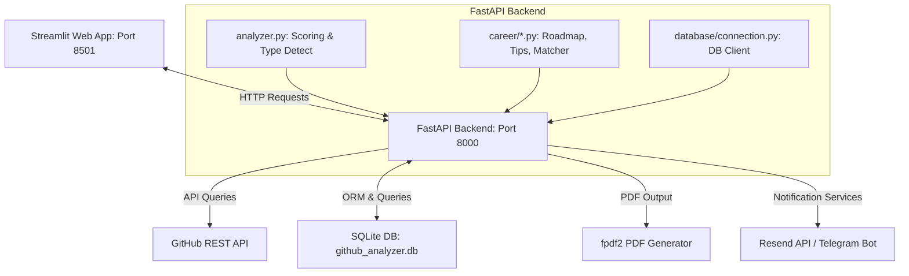

# 🗺️ GitHub Career Analyzer & AI Portfolio Auditor

[](https://www.python.org/)
[](https://fastapi.tiangolo.com/)
[](https://streamlit.io/)
[](https://pyfpdf.github.io/fpdf2/)
[](https://www.sqlite.org/)

An advanced, end-to-end, high-performance portfolio auditor and career readiness analyzer. By auditing a developer's public GitHub profile, this application parses repositories, languages, and commit activities to detect coding styles, calculate a developer score, evaluate compatibility against **15 distinct career roles** (across **5 experience levels**), match with company tiers, and generate beautiful, download-ready PDF career reports.

---

## 🌟 Key Features

### 🔍 1. Profile Quick Scan
* **Developer Type Detection**: ML-guided mapping of coding language metrics to primary developer roles.
* **Aesthetic Profile Scoring**: A balanced score evaluating profile completeness, project quantity, visibility (stars/forks), and documentation frequency.
* **Warning & Red Flag Detection**: Checks for common portfolio deficiencies like missing repository descriptions, inactive schedules, high fork ratios, or lack of contact details.
* **ATS Score Optimizer**: Simulates ATS parsers to evaluate your profile's discoverability and provides actionable recommendations to optimize it.

### 💼 2. Comprehensive Career Analysis
* **Role Fit Matcher**: Evaluates matching scores against **15 specialized job roles** across **5 career stages** (Beginner, Internship Seeker, Fresher, Working Professional, Senior).
* **2026 Skill Auditing**: Checks for modern skills (AI toolchains like GitHub Copilot, Cursor, LLM APIs, Next.js, Edge AI, etc.) alongside core foundation skills.
* **Company Tier Readiness**: Computes match percentages for *Startups*, *Mid-size Companies*, *Product Companies*, *FAANG/MAANG*, *Remote Opportunities*, and *Government/PSUs*.
* **Salary Insights**: Real-time localized (India/LPA) and Remote ($/yr) salary brackets based on selected role and experience level.
* **Dynamic PDF Reports**: Direct downloads for comprehensive, beautifully styled PDF reports for both Quick Scan and Career Analysis.

### 🛣️ 3. Personal Growth & Prep Engine
* **Tailored Roadmaps**: Customized week-by-week study planners with verified training resources (YouTube channels, documentation, practice portals).
* **Project Recommendations**: Mix of Beginner, Intermediate, and Advanced project suggestions complete with target tech stacks, estimation times, and marketplace relevance reasons.
* **Interview Prep Hub**: Curated list of common technical questions, portfolio optimization tips, common mistakes to avoid, and reference documentation.

---

## 🛠️ Architecture & Tech Stack



### Backend (API layer)
* **FastAPI**: Lightweight, asynchronous web framework exposing high-performance RESTful API endpoints.
* **Uvicorn**: High-performance ASGI web server.
* **Pydantic**: Robust data validation and settings management.

### Frontend (User Interface)
* **Streamlit**: Beautiful, dark-mode-styled interactive frontend dashboard.
* **Plotly**: Visual analytics engine representing developer type breakdowns and score trends.

### Data & Services
* **SQLite**: Embedded database client storing search history, user statistics, notifications, and leaderboard.
* **fpdf2**: PDF engine writing byte streams of customized reports, overriding standard layouts to gracefully strip non-Latin-1 chars/emojis.
* **Resend API / Telegram Bot**: Webhook triggers sending email alerts and direct Telegram channel updates.

---

## 📈 Milestones & Enhancements Completed

### 🏎️ 1. API Fetch Optimization (From 90s to Under 20s)
* **Problem**: Gathering details (languages and topics) for 30+ repositories sequentially took up to 90 seconds due to network latency, leading to FastAPI timeout crashes.
* **Solution**: Implemented `ThreadPoolExecutor(max_workers=5)` inside `github_api.py` to concurrently fetch repository details, and capped requests to the top 20 original repos. Response speeds dropped by **over 75%** (averaging ~15-20s).

### 🛡️ 2. Resilient Error Mitigation & Graceful Degradation
* **Safe JSON Parsing**: Wrapped frontend responses in `try-except` blocks. Streamlit will now show clear, user-friendly warnings instead of crashing with `JSONDecodeError` when the API rate limits or encounters internal errors.
* **FastAPI Exception Trapping**: Wrapped backend endpoints in try-catch-all structures, returning proper JSON details (`{"detail": "..."}`) rather than naked 500 server crashes.
* **Windows cp1252 Compatibility**: Stripped out non-ASCII emoji logs on startup and console output to prevent encoding errors on standard Windows shells.

### 📚 3. Massive Content Generation System
* Expanded `roadmap.py`, `projects.py`, and `interview_tips.py` to cover **all 15 job roles** with complete resources, difficulty curves, and interview insights.
* Covered roles:
  1. Frontend Developer
  2. Backend Developer
  3. Full Stack Developer
  4. ML/AI Engineer
  5. Data Scientist
  6. DevOps Engineer
  7. Android Developer
  8. iOS Developer
  9. Cloud Engineer
  10. Blockchain Developer
  11. Cybersecurity Engineer
  12. QA Engineer
  13. Data Engineer
  14. Game Developer
  15. Embedded Systems Engineer

---

## ⚡ Quick Start

### Prerequisites
* Python 3.12+ installed.
* GitHub Developer Personal Access Token (for high API rate limits).

### Setup Instructions

1. **Clone the Repository**:
   ```bash
   git clone <repository_url>
   cd github-career-analyzer
   ```

2. **Setup Virtual Environment**:
   ```bash
   python -m venv venv
   # On Windows:
   venv\Scripts\activate
   # On macOS/Linux:
   source venv/bin/activate
   ```

3. **Install Dependencies**:
   ```bash
   pip install -r requirements.txt
   ```

4. **Configure Environment Variables**:
   Create a `.env` file in the root directory:
   ```env
   GITHUB_TOKEN=your_personal_access_token_here
   SECRET_KEY=generate_a_secure_random_key_here
   
   # Optional Notifications setup
   RESEND_API_KEY=your_resend_api_key
   TELEGRAM_BOT_TOKEN=your_telegram_bot_token
   ```

### Running Locally

To run the application, open two terminal windows:

* **Terminal 1 (Backend API)**:
  ```bash
  venv\Scripts\activate
  python backend/main.py
  ```
  The API will start at [http://localhost:8000](http://localhost:8000).

* **Terminal 2 (Frontend Dashboard)**:
  ```bash
  venv\Scripts\activate
  streamlit run app.py
  ```
  The Streamlit app will start at [http://localhost:8501](http://localhost:8501) (or port `8502`).

---

## 🔮 Future Scopes & Scaling Roadmap

### 🔄 1. Advanced Auth & OAuth Integrations
* **GitHub Social Login**: Shift from manual username input to full OAuth authentication, enabling users to log in securely, check private repositories, and audit their commit activities.
* **Google OAuth**: Complete sign-in integration to persistent search histories across user devices.

### 🧠 2. Fine-Tuned LLM & ML Assessments
* **Vector Embeddings on Code**: Integrate a lightweight semantic search model to embed repository names/descriptions and map them to job role benchmarks.
* **Resume Parse & Comparison**: Let users upload their resume PDF, parse it, and compare their GitHub coding profile directly with their resume to highlight inconsistencies or gaps.

### 💬 3. Interactive AI Mock Interviews
* **Voice/Text Mock Simulator**: Provide an interactive mock interview system using an LLM configured with the selected job role. The agent asks questions based on the candidate's real portfolio projects and grades answers.

### 🧩 4. Sandbox Code Challenge Verification
* **Coding Challenge Sandbox**: Allow users to run short technical challenges in-browser to verify missing languages/skills detected on their roadmap, dynamically raising their Career Match Score upon completion.

### 📧 5. Weekly Email Analytics Digest
* **Progress Tracking**: Periodic cron jobs that monitor changes on the user's GitHub profile weekly, sending an automated email summarizing new skills, updated career scores, and roadmap updates.

---

## 📜 License
This project is licensed under the MIT License. See `LICENSE` for details.
